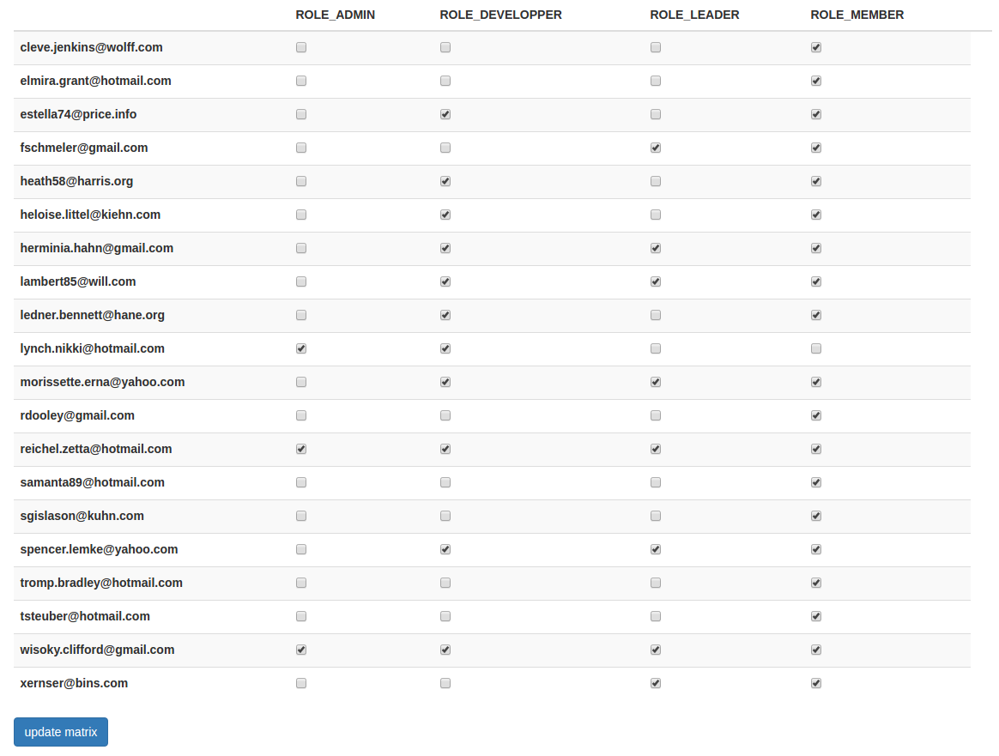

YokaiManyToManyMatrixBundle
===========================

This bundle aims to render Doctrine ManyToMany relations as a matrix in a Symfony form.


Installation
------------

### Add the bundle as dependency with Composer

``` bash
$ php composer.phar require yokai/many-to-many-matrix-bundle
```

### Enable the bundle in the kernel

``` php
<?php
// app/AppKernel.php

public function registerBundles()
{
    $bundles = [
        // ...
        new Yokai\ManyToManyMatrixBundle\YokaiManyToManyMatrixBundle(),
    ];
}
```


Usage
-----

Let's take an example : our application is handling Symfony's security with 2 Doctrine entity : `User` and `Role`.
There is a ManyToMany between `Role` and `User`.

```php
<?php
// src/AppBundle/Entity/User.php

namespace AppBundle\Entity;

use Doctrine\Common\Collections\ArrayCollection;
use Doctrine\ORM\Mapping as ORM;

/**
 * @ORM\Entity()
 * @ORM\Table(name="user")
 */
class User
{
    /**
     * @var int
     *
     * @ORM\Column(name="id", type="integer")
     * @ORM\Id()
     * @ORM\GeneratedValue(strategy="AUTO")
     */
    private $id;

    /**
     * @var string
     *
     * @ORM\Column(name="email", type="string", length=255, unique=true)
     */
    private $email;

    /**
     * @var Role[]|ArrayCollection
     *
     * @ORM\ManyToMany(targetEntity="Role", mappedBy="users")
     */
    private $roles;

    /**
     * @return string
     */
    public function __toString()
    {
        return $this->email;
    }

    //...
}
```

```php
<?php
// src/AppBundle/Entity/Role.php

namespace AppBundle\Entity;

use Doctrine\Common\Collections\ArrayCollection;
use Doctrine\ORM\Mapping as ORM;

/**
 * @ORM\Entity()
 * @ORM\Table(name="role")
 */
class Role
{
    /**
     * @var int
     *
     * @ORM\Column(name="id", type="integer")
     * @ORM\Id()
     * @ORM\GeneratedValue(strategy="AUTO")
     */
    private $id;

    /**
     * @var string
     *
     * @ORM\Column(name="role", type="string", length=255, unique=true)
     */
    private $role;

    /**
     * @var User[]|ArrayCollection
     *
     * @ORM\ManyToMany(targetEntity="User", inversedBy="roles")
     */
    private $users;

    public function __toString()
    {
        return $this->role;
    }

    //...
}
```

I want to create a form matrix that will display the relation of these entities.

```php
<?php
// src/AppBundle/Controller/MatrixController.php
namespace AppBundle\Controller;

use AppBundle\Entity\Role;
use Doctrine\ORM\EntityManager;
use Doctrine\ORM\EntityRepository;
use Sensio\Bundle\FrameworkExtraBundle\Configuration\Route;
use Symfony\Bundle\FrameworkBundle\Controller\Controller;
use Symfony\Component\HttpFoundation\Request;
use Symfony\Component\HttpFoundation\Response;
use Yokai\ManyToManyMatrixBundle\Form\Type\ManyToManyMatrixType;

class MatrixController extends Controller
{
    /**
     * @Route("/role-matrix", name="role-matrix")
     *
     * @param Request $request
     *
     * @return Response
     */
    public function roleMatrixAction(Request $request)
    {
        $roles = $this->getRepository()->findAll();

        $form = $this->createForm(
            ManyToManyMatrixType::class,
            $roles,
            [
                'class' => Role::class,
                'association' => 'users',
            ]
        );

        $form->handleRequest($request);

        if (!$form->isSubmitted() || !$form->isValid()) {
            return $this->render('role-matrix.html.twig', [
                'form' => $form->createView(),
            ]);
        }

        $manager = $this->getManager();

        foreach ($roles as $role) {
            $manager->persist($role);
        }

        $manager->flush($roles);

        return $this->redirectToRoute('role-matrix');
    }

    /**
     * @return EntityRepository
     */
    private function getRepository()
    {
        return $this->getDoctrine()->getRepository(Role::class);
    }

    /**
     * @return EntityManager
     */
    private function getManager()
    {
        return $this->getDoctrine()->getManagerForClass(Role::class);
    }
}
```

```twig



    {{ form_start(form) }}
        {{ form_widget(form) }}
        <button type="submit" class="btn btn-primary">update matrix</button>
    {{ form_end(form) }}

```




Important Notes
---------------

In the example above, we must note several **IMPORTANT** things.

### Owning side

You **MUST** work with the [owning side](http://doctrine-orm.readthedocs.io/projects/doctrine-orm/en/latest/reference/unitofwork-associations.html)
  of your association (i.e. the entity that has the `ìnversedBy` attribute on its ManyToMany property)

### __toString

The two entities **MUST** have a `__toString` method to render the label


MIT License
-----------

License can be found [here](https://github.com/yann-eugone/many-to-many-matrix-bundle/blob/master/Resources/meta/LICENSE).


Authors
-------

The bundle was originally created by [Yann Eugoné](https://github.com/yann-eugone).
See the list of [contributors](https://github.com/yann-eugone/many-to-many-matrix-bundle/contributors).
